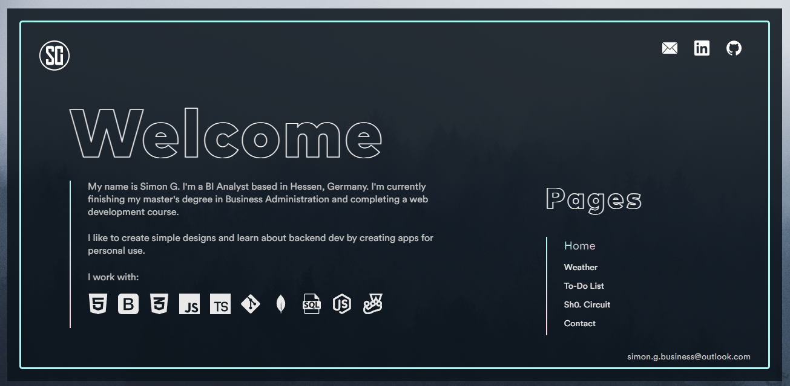

## Description
In order to build on my experiences from designing my first webpage, I've decided to create a new website using HTML, CSS and Javascript.
The goal of this project was to create a website, on which I can display my portfolio projects, while focusing on design, 
effective space usage and sleek UI. 

[The webpage can be viewed here.](https://simon-g1.github.io/Portfolio-Webpage-V2/#)

## Limitations
In order to get more familiar with creating simple animations & transitions in CSS & Javascript, no external libraries like Bootstrap were used, the only
exception being a 3d background imported from Vanta.js.

## Lessons Learned 
- Tooltips, Font faces & declaring variables in CSS
- Absolute positioning & overlays 
- Transform & Transition properties 
- Dynamic resizing of elements during run time with JavaScript
- Contact form with Email.js

